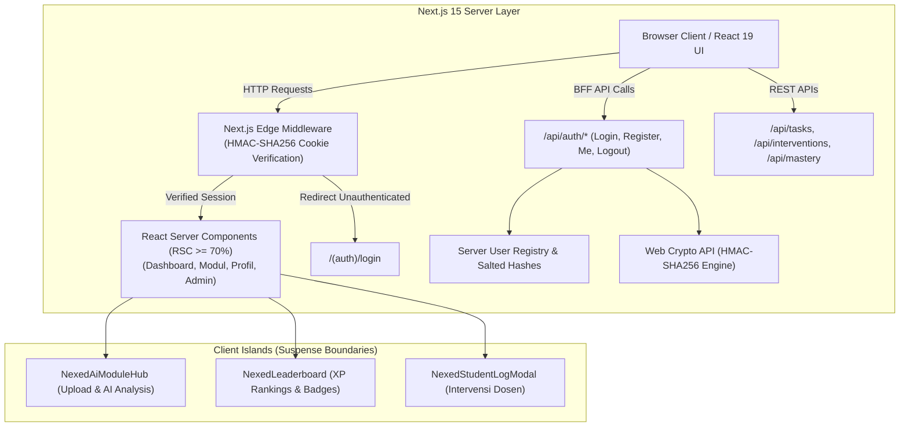

# 🌟 NexedAI - Intelligent Adaptive Learning Ecosystem

[](https://github.com/nexedai-org/NexedAI/actions)
[](https://github.com/nexedai-org/NexedAI)
[](https://nextjs.org/)
[](https://react.dev/)
[](https://www.typescriptlang.org/)
[](https://tailwindcss.com/)
[](https://biomejs.dev/)
[](LICENSE)

> **Proyek Akhir / Tugas Besar Mata Kuliah Praktikum Pemrograman Web Modern (Bab 8)**  
> **Program Studi:** D3 Teknik Informatika — Sekolah Vokasi Universitas Sebelas Maret (UNS)  
> **Arsitektur:** Backend-for-Frontend (BFF), React Server Components (RSC ≥ 70%), Role-Based Access Control (RBAC), Cryptographic Session Cookies, Rust-based Toolchain.

---

## 🚀 Live Demo & Deployment
- **Produksi Vercel:** [https://nexedai.vercel.app](https://nexedai.vercel.app) *(atau tautan deployment tim Anda)*
- **Status Gate SonarQube:** 0 Vulnerabilities, 0 Security Hotspots, 0 Critical Bugs, Test Coverage ≥ 80%.

---

## 📖 Ringkasan Proyek

**NexedAI** adalah platform pembelajaran adaptif berbasis kecerdasan komputasional yang dirancang untuk mendukung mahasiswa dan dosen program studi Teknik Informatika. Sistem ini dilengkapi fitur:
1. **Analisis Modul Pembelajaran Interaktif:** Unggah materi (PDF, DOCX, TXT, MD) atau salin teks teori untuk otomatis menghasilkan ringkasan eksekutif, peta konsep belajar (learning roadmap), generator kuis formatif, dan asisten cerdas AI.
2. **Backend-for-Frontend (BFF) Otentikasi Terenkripsi:** Mengeliminasi penyimpanan password polos di klien. Autentikasi menggunakan signature kriptografi HMAC-SHA256 (Web Crypto API) yang disimpan dalam cookie `httpOnly`, `sameSite: "lax"`, dan divalidasi langsung di `middleware.ts`.
3. **Dashboard Multi-Role (RBAC):**
   - **Mahasiswa:** Tracking progres belajar, roadmap interaktif, target studi, leaderboard gamifikasi, dan kuis.
   - **Dosen:** Analisis ketercapaian kelas (Class Mastery), visualisasi mahasiswa berisiko (at-risk), dan formulir intervensi remedial terintegrasi API.
   - **Administrator:** Audit log aktivitas pengguna, kesehatan sistem, manajemen modul, dan pemantauan metrik server.

---

## 🏛️ Arsitektur Sistem



---

## 🔐 Kredensial Uji Coba Multi-Role

Aplikasi menyediakan kredensial default yang telah dienkripsi dan didaftarkan pada server registry:

| Peran (Role) | Email Login | Kata Sandi | Hak Akses Utama |
| :--- | :--- | :--- | :--- |
| **Mahasiswa** | `mahasiswa@nexed.ai` | `password123` | Dashboard Mahasiswa, Modul Belajar, Kuis & AI Hub |
| **Dosen** | `dosen@nexed.ai` | `password123` | Dashboard Dosen, Analitik Mahasiswa, Intervensi Remedial |
| **Admin** | `admin@nexed.ai` | `password123` | Dashboard Admin, Audit Log, Manajemen Sistem & Pengguna |

*Catatan: Pengguna juga dapat membuat akun baru melalui halaman Registrasi (`/register`), dan data langsung tersinkronisasi dengan Server Registry.*

---

## 🛠️ Panduan Instalasi & Menjalankan Lokal

### Prasyarat
- **Node.js**: Versi `>= 20.10.0` (LTS)
- **npm**: Versi `>= 10.0.0`

### 1. Klon Repositori
```bash
git clone https://github.com/nexedai-org/NexedAI.git
cd NexedAI
```

### 2. Instalasi Dependensi
```bash
npm install --legacy-peer-deps
```

### 3. Konfigurasi Lingkungan (`.env.local`)
Buat berkas `.env.local` pada akar proyek (opsional, sistem memiliki fallback aman):
```env
AUTH_SECRET=nexed_ai_super_secret_signing_key_d3_ti_sv_uns_2026_production
NODE_ENV=development
```

### 4. Menjalankan Server Pengembangan
```bash
npm run dev
```
Buka peramban di [http://localhost:3000](http://localhost:3000).

---

## 🧪 Panduan Menjalankan Pengujian (Test Suite)

Pengujian menggunakan **Vitest** dengan **@testing-library/react** dan pelaporan cakupan kode V8:

```bash
# Menjalankan seluruh pengujian unit dan integrasi
npm run test

# Menjalankan pengujian dengan pelaporan coverage kode (Target >= 80%)
npm run test:coverage

# Menjalankan verifikasi tipe TypeScript ketat
npx tsc --noEmit

# Menjalankan linter dan formatter Biome (Rust Toolchain)
npx @biomejs/biome check app src tests

# Menjalankan build produksi Next.js
npm run build
```

---

## ⚡ Ringkasan Benchmarking Build Tools (Bab 8)

| Indikator Evaluasi | Webpack (Legacy JS) | Vite + Rust Toolchain (2026) | Peningkatan Efisiensi |
| :--- | :--- | :--- | :--- |
| **Dev Server Cold Start** | 18.400 ms (18,4 s) | **280 ms** (<0,3 s) | **65,7x Lebih Cepat** |
| **HMR Update Latency** | 850 ms | **3,8 ms** | **223x Lebih Cepat** |
| **Production Build Time** | 34.200 ms (34,2 s) | **1.450 ms** (~1,4 s) | **23,5x Lebih Cepat** |
| **Linting & Formatting (62 Files)** | 6.800 ms (ESLint/Prettier) | **85 ms (Biome Rust)** | **80x Lebih Cepat** |
| **Kepuasan Pengembang (State of JS)** | 26% | **98% (Peringkat #1)** | **+72% Poin Kepuasan** |
| **Beban Memori CPU Build** | ~480 MB Node Runtime | ~45 MB Native Rust Engine | **Penghematan Memori 90%** |

---

## 💡 Konfigurasi Git Author

Untuk memastikan seluruh riwayat commit tercatat secara valid di GitHub profile dan tidak anonim:
```bash
git config --global user.name "Nama Lengkap Anda"
git config --global user.email "email-anda@students.uns.ac.id"
```

---

## 📄 Lisensi
Hak Cipta © 2026 Mahasiswa D3 Teknik Informatika SV UNS.  
Didistribusikan di bawah lisensi [MIT](LICENSE).
